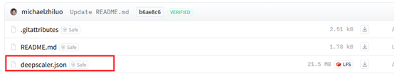
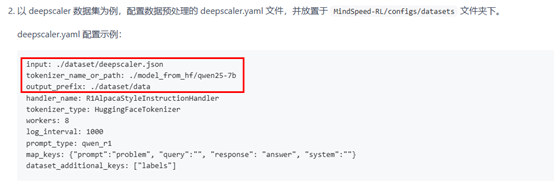
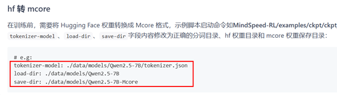
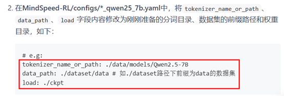

# 环境准备
本实验使用的主要环境信息如下:

| 依赖软件              | 版本     |
|:------------------|:-------|
| CANN              | 8.2RC1 |
| Python            | 3.10   |
| MindSpore         | 2.7.1  |
| MindSpeed-Core-MS | r0.3.0 |

[dockerfile_unified](./dockerfiles/dockfile_unified)中打入了**CANN**与**Python**, 开发者可基于此镜像或任何包含指定**CANN**和**Python**版本的环境中完成实验。
其他依赖安装参考以下步骤。

## MindSpore安装

安装MindSpore 2.7.1版本，安装教程请参考[MindSpore快速安装](https://www.mindspore.cn/install)。

执行以下命令

```bash

python -c "import mindspore;mindspore.set_device('Ascend');mindspore.run_check()"

```
如果输出

```text

MindSpore version: 版本号
The result of multiplication calculation is correct, MindSpore has been installed on platform [Ascend] successfully!

```
说明MindSpore安装成功。


## MindSpeed-Core-MS及相关依赖安装

执行以下命令拉取MindSpeed-Core-MS代码仓，并安装Python三方依赖库

```
git clone https://gitee.com/ascend/MindSpeed-Core-MS.git -b r0.3.0 
cd MindSpeed-Core-MS
pip install -r requirements.txt
```

然后执行以下命令一键适配

```
source auto_convert_rl.sh
cd MindSpeed-RL
```


# Qwen2.5-7B GRPO实验全流程
参考[Qwen2.5-7B GRPO指导流程](https://gitee.com/ascend/MindSpeed-Core-MS/blob/r0.3.0/docs/GRPO_Qwen25_7B.md)
进行GRPO的实验。实验指导已比较全面，因此该部分指出遇到的问题和解决方案。

1. 在**数据预处理**的数据集下载部分，服务器Hugging Face访问受限时，需要手动下载数据集上传到服务器，仅下载红框部分即可。<br>


2. 在**数据预处理**的数据预处理配置文件部分，红框内的路径为了避免路径找不到, 改成用绝对路径,不要用相对路径。<br><br>
此外，tokenizer_name_or_path属性需要自行从Hugging Face下载[qwen2.5 7b](https://huggingface.co/Qwen/Qwen2.5-7B/tree/main)模型。<br>


3. 在**权重转换**的hf转mcore部分，红框部分的路径同样需要绝对路径。
额外需要注意的是，target-tensor-parallel-size和target-pipeline-parallel-size设置需要与后续拉起训练的配置保持一致，本次实验1节点8卡，
actor4卡，target-tensor-parallel-size=4，target-pipeline-parallel-size=1； ref和reward2卡，target-tensor-parallel-size=2，target-pipeline-parallel-size=1。
请根据自己的实际情况进行权重转化，不同配置的权重需要单独转化。<br>



4. 在**脚本启动**部分,红框配置需要绝对路径，且target-tensor-parallel-size、target-pipeline-parallel-size配置需要与前文保持一致，参考以下配置。<br>
<br>
**MindSpeed-RL/configs/grpo_trainer_qwen25_7b.yaml**文件请参考以下配置。<br>
```
actor_config:
  model: qwen25_7b
  micro_batch_size: 1
  # tp, pp请与权重转化保持一致
  tensor_model_parallel_size: 4
  pipeline_model_parallel_size: 1
  lr: 1e-7
  lr_decay_style: constant
  min_lr: 0.0
  weight_decay: 0.0
  lr_warmup_fraction: 0.0
  clip_grad: 10000.0
  adam_beta1: 0.9
  adam_beta2: 0.999
  initial_loss_scale: 4096
  finetune: true
  # 请使用绝对路径
  load: /xxx/MindSpeed-Core-MS/MindSpeed-RL/models/Qwen2.5-7B-Mcore
  save: ./ckpt
  no_load_optim: true
  no_load_rng: true

ref_config:
  model: qwen25_7b
  # tp, pp请与权重转化保持一致
  tensor_model_parallel_size: 2
  pipeline_model_parallel_size: 1
  micro_batch_size: 1
  # 请使用绝对路径
  load: /xxx/MindSpeed-Core-MS/MindSpeed-RL/models/Qwen2.5-7B-Mcore-tp2
  no_load_optim: true
  no_load_rng: true

reward_config:
  model: qwen25_7b
  # tp, pp请与权重转化保持一致
  tensor_model_parallel_size: 2
  pipeline_model_parallel_size: 1
  micro_batch_size: 1
  # 请使用绝对路径
  load: /xxx/MindSpeed-Core-MS/MindSpeed-RL/models/Qwen2.5-7B-Mcore-tp2
  no_load_optim: true
  no_load_rng: true
```
推理部分也需要保持一致。
```
generate_config:
  # tokenizer相关配置
  micro_batch_size: 1
  trust_remote_code: true

  # 推理时的并行配置
  infer_tensor_parallel_size: 4
  infer_pipeline_parallel_size: 1
  infer_expert_parallel_size: 1
```

5. 最后请选择**从主节点执行**，**examples/r1/qwen25/r1_zero_qwen25_7b_master.sh**请参考以下配置：<br>
```
DEFAULT_YAML="grpo_trainer_qwen25_7b.yaml"
YAML=${1:-$DEFAULT_YAML}
echo "Use $YAML"

ulimit -n 32768
mkdir logs

# 请注意NNODES和NPUS_PER_NODE的配置
# 共使用多少节点训练
NNODES=1
# 每个节点有多少张卡
NPUS_PER_NODE=8

# 主节点启动
ray start --head --port 6344 --dashboard-host=0.0.0.0 --dashboard-port=8260 --resources='{"NPU": '$NPUS_PER_NODE'}'

while true; do
    ray_status_output=$(ray status)
    npu_count=$(echo "$ray_status_output" | grep -oP '(?<=/)\d+\.\d+(?=\s*NPU)' | head -n 1)
    npu_count_int=$(echo "$npu_count" | awk '{print int($1)}')
    device_count=$((npu_count_int / $NPUS_PER_NODE))

    # 判断 device_count 是否与 NNODES 相等
    if [ "$device_count" -eq "$NNODES" ]; then
        echo "Ray cluster is ready with $device_count devices (from $npu_count NPU resources), starting Python script."
        ray status
        python cli/train_grpo.py --config-name $YAML 2>&1 | tee logs/training.log
        break
    else
        echo "Waiting for Ray to allocate $NNODES devices. Current device count: $device_count"
        sleep 5
    fi
done
```
配置完成后执行```bash examples/r1/qwen25/r1_zero_qwen25_7b_master.sh```即可启动GRPO的训练任务。

# 其他注意事项
1. 如果出现xxx：command not found 或者 xxx：No such file or directory的报错，但是xxx可以通过pip show找到，
说明没有将对应的依赖添加到环境变量中，需要自己手动配置一下环境变量，以ray举例：<br>
先使用```pip show ray```找到ray的安装路径（Location字段），然后将其添加到path中，参考以下命令行<br>
```
export PATH=$PATH:/usr/local/python3.10.14/bin/
```

2. 出现``ConnectionError: Ray is trying to start at 172.17.0.10:6344, but is already running at 172.17.0.10:6344. 
Please specify a different port using the `--port` flag of `ray start` command. ``
是因为之前已经在这个端口启动过ray集群了，现在再从这个端口启动就产生了冲突，需要在每次拉起训练脚本后，
使用```ray stop -force```强制关闭ray集群后，重新启动训练脚本。
