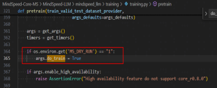
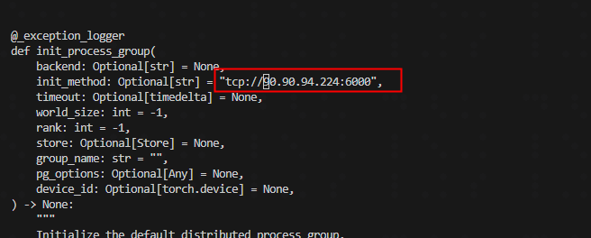

# 实验简介

本实验在完成Qwen2.5-7B-Instruct预训练的基础上，使用内存模拟工具DryRun模拟相同配置下的预训练，对比内存占用情况，从而证明DryRun工具可以作为模型训练资源规划和问题诊断的有效手段，避免真实训练的资源消耗和时间成本。


# 环境准备

本实验使用的主要环境信息如下:

| 依赖软件              | 版本     |
|:------------------|:-------|
| CANN              | 8.2RC1 |
| Python            | 3.10   |
| MindSpore         | 2.7.1  |
| MindSpeed-Core-MS | r0.4.0 |

[dockerfile_unified](../dockerfiles/dockfile_unified)中打入了**CANN**与**Python**, 开发者可基于此镜像或任何包含指定**CANN**和**Python**版本的环境中完成实验。
其他依赖安装参考以下步骤。


## MindSpore安装

安装MindSpore 2.7.1版本，安装教程请参考[MindSpore快速安装](https://www.mindspore.cn/install)。

执行以下命令

```bash

python -c "import mindspore;mindspore.set_device('Ascend');mindspore.run_check()"

```
如果输出

```bash

MindSpore version: 版本号
The result of multiplication calculation is correct, MindSpore has been installed on platform [Ascend] successfully!

```
说明MindSpore安装成功了。


## MindSpeed-LLM及相关依赖安装


```bash

# 安装MindSpeed-Core-MS转换工具
git clone https://gitcode.com/Ascend/MindSpeed-Core-MS.git  -b r0.4.0

# 使用MindSpeed-Core-MS内部脚本提供配置环境
cd MindSpeed-Core-MS
pip install -r requirements.txt
source auto_convert.sh llm
cd MindSpeed-LLM

```

# RryRun模拟Qwen2.5-7B-Instruct预训练流程

## 权重转换

1. 权重以及模型文件下载

执行以下命令下载

```bash

pip install modelscope
modelscope download --model Qwen/Qwen2.5-7B-Instruct --local_dir ./qwen2.5_7b_hf

```

2. 权重转换
 
在权重转换脚本`examples/mindspore/qwen25/ckpt_convert_qwen25_hf2mcore.sh`中配置`tp并行大小--target-tensor-parallel-size`，`pp并行大小--target-pipeline-parallel-size`，`模型加载路径--load-dir`，`模型保存路径--save-dir`，`模型tokenizer路径--tokenizer-model`，参考脚本如下：

```bash
python convert_ckpt.py \
       --use-mcore-models \
       --model-type GPT \
       --load-model-type hf \
       --save-model-type mg \
       --target-tensor-parallel-size 2 \
       --target-pipeline-parallel-size 2 \
       --add-qkv-bias \
       --load-dir ./qwen2.5_7b_hf/ \
       --save-dir ./model_weights/qwen2.5_mcore/ \
       --tokenizer-model ./qwen2.5_7b_hf/tokenizer.json \
       --model-type-hf llama2 \
       --params-dtype bf16
```

执行以下命令权重转换

```bash

cd MindSpeed-LLM
bash examples/mindspore/qwen25/ckpt_convert_qwen25_hf2mcore.sh

```


运行脚本后，预期会看到类似以下的日志输出，表示权重转换成功：

```

successfully saved checkpoint from iteration 1 to ./model_weights/qwen2.5_mcore/
INFO:root:Done!
```


## 数据预处理(以Alpaca数据集为例)

1. 数据集下载

数据集下载可以基于[网页](https://hf-mirror.com/datasets/tatsu-lab/alpaca/blob/main/data/train-00000-of-00001-a09b74b3ef9c3b56.parquet)直接下载，也可以基于以下命令行下载

```bash

mkdir dataset
cd dataset/
wget https://hf-mirror.com/datasets/tatsu-lab/alpaca/blob/main/data/train-00000-of-00001-a09b74b3ef9c3b56.parquet
cd ..

```
2. 数据集预处理

在预训练数据预处理脚本examples/mindspore/qwen25/data_convert_qwen25_pretrain.sh中配置好数据输入路径--input，数据输出路径--output-prefix、tokenizer模型路径--tokenizer-name-or-path， 参考脚本如下

```bash
python ./preprocess_data.py \
        --input ./dataset/train-00000-of-00001-a09b74b3ef9c3b56.parquet \
        --tokenizer-name-or-path ./qwen2.5_7b_hf/ \
        --output-prefix ./dataset/alpaca \
        --tokenizer-type PretrainedFromHF \
        --workers 4 \
        --log-interval 1000
```
执行以下命令处理数据集

```bash

bash examples/mindspore/qwen25/data_convert_qwen25_pretrain.sh

```

预训练数据集处理结果如下

```bash

./dataset/alpaca_text_document.bin
./dataset/alpaca_text_document.idx

```
> 注意：预训练时，数据集路径 --data-path 参数传入 ./dataset/alpaca_text_document 即可


## DryRun模拟预训练

1. 修改文件 /MindSpeed-Core-MS/MindSpeed-LLM/mindspeed_llm/training/training.py中的pretain函数，在pretain函数的开头部分添加以下代码行

```python

if os.environ.get("MS_DRY_RUN") == "1":
     args.do_train = True

```
 具体效果如下图所示



2. 修改文件 /MindSpeed-Core-MS/MSAdapter/mmsadpter/distributed/distributed_c10d.py中的init_method为"tcp://ip:port"，此处ip和port根据实际情况修改即可




3. 修改预训练文件 pretrain_qwen25_7b_32k_ms.sh 

配置模型加载路径`CKPT_LOAD_DIR`，模型保存路径`CKPT_SAVE_DIR`，数据集路径`DATA_PATH`，tokenizer路径`TOKENIZER_PATH`，并添加DryRun配置


- 场景一：DryRun模拟预训练+无重计算参考脚本如下

```bash
CKPT_LOAD_DIR="./model_weights/qwen2.5_mcore/iter_0000001"
CKPT_SAVE_DIR="./output-model/nonrecompute"
DATA_PATH="./dataset/alpaca_text_document"
TOKENIZER_PATH="./qwen2.5_7b_hf"

TP=2
PP=2
SEQ_LEN=10240
MBS=1
GBS=64

export MS_SIMULATION_LEVEL=1
export MS_DRY_RUN=1
export GLOG_v=1

DISTRIBUTED_ARGS="
    --worker_num $WORLD_SIZE \
    --local_worker_num $NPUS_PER_NODE \
    --master_addr $MASTER_ADDR \
    --master_port $MASTER_PORT \
    --rank $NODE_RANK \
    --log_dir msrun_log \
    --join=False \
    --sim_level 1
"

GPT_ARGS="
    ...
    --train-iters 3 \
    ...
"
```
- 场景二：DryRun模拟预训练+重计算参考脚本如下

```bash
CKPT_LOAD_DIR="./model_weights/qwen2.5_mcore/iter_0000001"
CKPT_SAVE_DIR="./output-model/recompute"
DATA_PATH="./dataset/alpaca_text_document"
TOKENIZER_PATH="./qwen2.5_7b_hf"

TP=2
PP=2
SEQ_LEN=10240
MBS=1
GBS=64

export MS_SIMULATION_LEVEL=1
export MS_DRY_RUN=1
export GLOG_v=1

DISTRIBUTED_ARGS="
    --worker_num $WORLD_SIZE \
    --local_worker_num $NPUS_PER_NODE \
    --master_addr $MASTER_ADDR \
    --master_port $MASTER_PORT \
    --rank $NODE_RANK \
    --log_dir msrun_log \
    --join=False \
    --sim_level 1
"

GPT_ARGS="
    ...
    --train-iters 3 \
    ...
    --recompute-granularity full \   #开启完全重计算 
    --recompute-method uniform \  #重计算方式为uniform
    --recompute-num-layers 1 \  #每1层进行一次重计算
"
```

4. 执行脚本

```bash

bash examples/mindspore/qwen25/pretrain_qwen25_7b_32k_ms.sh

```
5. 查看日志信息

运行后可在rank_x目录下的log中找到如下打印：

```

Device MOC memory size: 65536M
MindSpore Used memory size: 59392M
MindSpore memory base address: 0xffffe9dc1407
Used peak memory usage (without fragments): 55389M
Actual peak memory usage (with fragments): 55341M

```
该示例表示：

device总内存大小，为65536MB，即64GB。

MindSpore框架当前实际可调用的内存量为59392MB，即约58GB。

MindSpore分配的内存的起始地址为0xffffe9dc1407。

MindSpore框架在不考虑内存碎片的情况下，曾经达到的峰值内存使用量为55389M。

MindSpore框架在考虑内存碎片的情况下，曾经达到的实际峰值内存使用量为55341M，内存碎片是指由于内存分配和释放导致的内存空间不连续的情况，该值考虑了这些碎片的影响

# DryRun模拟和实际预训练结果对比

## 实验环境
- Atlas 800 训练服务器	910系列 AI加速卡
- HBM：64GB
- 最大卡数：8卡（该实验实际使用4卡）

## 实验结果

<table style="width: 100%;">
  <tr>
    <th style="width: 25%;">场景</th>
    <th style="width: 45%;">内存占用</th>
    <th style="width: 30%;">结论</th>
  </tr>
  <tr>
    <td>真实预训练+无重计算</td>
    <td>Device MOC memory size: 62420M<br>
MindSpore Used memory size: 58178M<br>
Used peak memory usage (without fragments): 55405M<br>
Actual peak memory usage (with fragments): 57400M
</td>
    <td  rowspan="2" style="vertical-align: middle;">1. DryRun可以模拟实际预训练显存使用<br>
2. DryRun和实际预训练显存使用的差距：主要差距在算子的workspace内存，因为workspace的计算依赖CANN的接口，DryRun无法调用这些接口
</td>
  </tr>
  <tr>
    <td>DryRun模拟预训练+无重计算</td>
    <td>Device MOC memory size: 65536M<br>
MindSpore Used memory size: 61430M<br>
MindSpore memory base address: 0xfffff8263897<br>
Used peak memory usage (without fragments): 55389M<br>
Actual peak memory usage (with fragments): 57341M
</td>
  </tr>
  <tr>
    <td>真实预训练+重计算</td>
    <td>Device MOC memory size: 62420M<br>
MindSpore Used memory size: 58166M<br>
Used peak memory usage (without fragments): 35073M<br>
Actual peak memory usage (with fragments): 36174M<br>
</td>
    <td rowspan="2" style="vertical-align: middle;">DryRun可以模拟实际预训练+重计算场景显存使用</td>
  </tr>
  <tr>
    <td>DryRun模拟预训练+重计算</td>
    <td>Device MOC memory size: 65536M<br>
MindSpore Used memory size: 61430M<br>
MindSpore memory base address: 0xffffc1f4bfe7<br>
Used peak memory usage (without fragments): 34946M<br>
Actual peak memory usage (with fragments): 35720M
</td>
  </tr>
</table>
