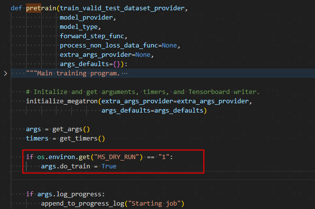
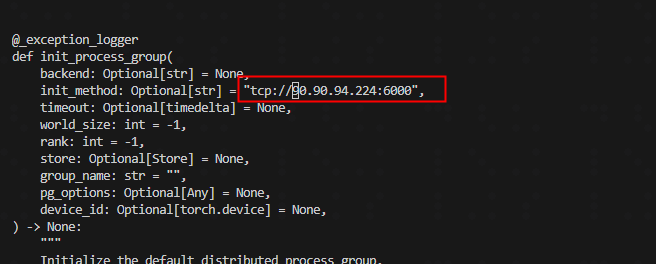

# 实验简介

介绍dryrun工具的使用方法，帮助用户降低开发与调试成本。


# 环境准备

参考[Chapter2](https://github.com/mindspore-lab/MindSpore-Compatible-Distributed-Training-Principles-and-Practices/tree/dev/Chapter2)章节的环境准备。

# dryrun模拟Qwen2.5-7B-Instruct预训练流程

参考Chapter2章节，完成权重转换和数据预处理流程后，进行以下的流程。

## dryrun模拟预训练

1. 修改文件 ./mindspeed_llm/training/training.py中的pretain函数，在pretain函数的开头部分添加以下代码行

```python

if os.environ.get("MS_DRY_RUN") == "1":
     args.do_train = True

```
 具体效果如下图所示



2. 修改文件 ../MSAdapter/msadpter/distributed/distributed_c10d.py中方法init_process_group()的参数init_method为"tcp://ip:port"，此处ip和port根据实际情况修改即可




3. 修改预训练文件 pretrain_qwen25_7b_32k_ms.sh 

配置模型加载路径`CKPT_LOAD_DIR`，模型保存路径`CKPT_SAVE_DIR`，数据集路径`DATA_PATH`，tokenizer路径`TOKENIZER_PATH`，并添加dryrun配置


- 场景一：dryrun模拟预训练+无重计算参考脚本如下

```bash

#路径配置
CKPT_LOAD_DIR="./model_weights/qwen2.5_mcore/iter_0000001"
CKPT_SAVE_DIR="./output-model/nonrecompute"
DATA_PATH="./dataset/alpaca_text_document"
TOKENIZER_PATH="./qwen2.5_7b_hf"

TP=2
PP=2
SEQ_LEN=10240
MBS=1
GBS=64

#dryrun配置
export MS_SIMULATION_LEVEL=1
export MS_DRY_RUN=1
export GLOG_v=1

#注意：参数--node_rank要改成--rank
DISTRIBUTED_ARGS="
    ...
    --rank $NODE_RANK \
    --log_dir msrun_log \
    --sim_level 1
    ...
"

GPT_ARGS="
    ...
    --train-iters 3 \
    ...
"
```
- 场景二：dryrun模拟预训练+重计算参考脚本如下

```bash

#路径配置
CKPT_LOAD_DIR="./model_weights/qwen2.5_mcore/iter_0000001"
CKPT_SAVE_DIR="./output-model/recompute"
DATA_PATH="./dataset/alpaca_text_document"
TOKENIZER_PATH="./qwen2.5_7b_hf"

TP=2
PP=2
SEQ_LEN=10240
MBS=1
GBS=64

#dryrun配置
export MS_SIMULATION_LEVEL=1
export MS_DRY_RUN=1
export GLOG_v=1

DISTRIBUTED_ARGS="
    ...
    --rank $NODE_RANK \
    --log_dir msrun_log \
    --sim_level 1
    ...
"

GPT_ARGS="
    ...
    --train-iters 3 \
    ...
    --recompute-granularity full \   #开启完全重计算 
    --recompute-method uniform \  #重计算方式为uniform
    --recompute-num-layers 1 \  #每1层进行一次重计算
"
```

4. 执行脚本

```bash

bash examples/mindspore/qwen25/pretrain_qwen25_7b_32k_ms.sh

```
5. 查看日志信息

运行后可在msrun_log目录下的log中找到如下打印：

```

Device MOC memory size: 65536M
MindSpore Used memory size: 59392M
MindSpore memory base address: 0xffffe9dc1407
Used peak memory usage (without fragments): 55405M
Actual peak memory usage (with fragments): 57400M

```
该示例表示：

device总内存大小，为65536MB，即64GB。

MindSpore框架当前实际可调用的内存量为59392MB，即约58GB。

MindSpore分配的内存的起始地址为0xffffe9dc1407。

MindSpore框架在不考虑内存碎片的情况下，曾经达到的峰值内存使用量为55405M。

MindSpore框架在考虑内存碎片的情况下，曾经达到的实际峰值内存使用量为57400M，内存碎片是指由于内存分配和释放导致的内存空间不连续的情况，该值考虑了这些碎片的影响

# dryrun模拟和实际预训练结果对比

## 实验环境
- Atlas 800 训练服务器	910系列 AI加速卡
- HBM：64GB
- 最大卡数：8卡（该实验实际使用4卡）

## 实验结果

<table style="width: 100%; table-layout: fixed;">
  <tr>
    <th>场景</th>
    <th>Device MOC memory size</th>
    <th>MindSpore Used memory size</th>
    <th>Used peak memory usage (without fragments)</th>
    <th>Actual peak memory usage (with fragments)</th>
    <th>结论</th>
  </tr>
  <tr>
    <td>真实预训练+无重计算</td>
    <td>62420M</td>
    <td>58178M</td>
    <td>55405M</td>
    <td>57400M</td>
    <td  rowspan="2" style="vertical-align: middle;">1. dryrun模拟的显存占用与实际显存占用差距较小<br>
2. dryrun和实际预训练显存使用的差距：主要差距在算子的workspace内存，因为workspace的计算依赖CANN的接口，dryrun无法调用这些接口
</td>
  </tr>
  <tr>
    <td>dryrun模拟预训练+无重计算</td>
    <td>65536M</td>
    <td>61430M</td>
    <td>55389M</td>
    <td>57341M</td>
  </tr>
  <tr>
    <td>真实预训练+重计算</td>
    <td>62420M</td>
    <td>58166M</td>
    <td>35073M</td>
    <td>36174M</td>
    <td rowspan="2" style="vertical-align: middle;">dryrun模拟实际预训练+重计算场景的显存占用与实际显存占用差距较小</td>
  </tr>
  <tr>
    <td>dryrun模拟预训练+重计算</td>
    <td>65536M</td>
    <td>61430M</td>
    <td>34946M</td>
    <td>35720M</td>
  </tr>
</table>